# Design Strategy & Architecture Analysis Report
**Target File:** `e:\MES\MES\MES\docs\architecture_map.md`  
**Author:** Explorer 2 (Read-only Investigation Agent)  

---

## 1. Executive Summary
This report defines the recommended design strategy for `architecture_map.md`, which contains a Mermaid diagram visualizing the technical transition of the SN MES system from a line-based production recording model to a machine-based recording model. 

Through analysis of the codebase, database scripts, and application architectures, we have mapped the legacy components (line-centric) to the new enterprise systems (machine-centric). The resulting design strategy ensures complete adherence to the user requirements: visual phase division (R1), a strong machine-based data recording focus (R2), and integration of both new and legacy systems (R3).

---

## 2. Technical Mapping of the Transition

### 2.1 Database Schema Evolution
The database is undergoing a transition from line-level metrics with manual, string-based inputs to structured, relational tables with foreign keys linking directly to physical machines (`PE_MACHINES` registry):

| Area / Feature | Legacy Table (Line-Centric) | New Table (Machine-Centric) | Integration Mechanism |
|---|---|---|---|
| **Machine Registry** | None (free-form text in logs) | `PE_MACHINES` | Registry of machine codes, names, lines, and MQTT topics. |
| **Downtime Logs** | `STOP_CAUSES` | `PE_DOWNTIME_LOG` | Migrated via `migrate_legacy.php`; `machine_id` FK references `PE_MACHINES`. |
| **Maintenance Work Orders** | `MAINTENANCE_REQUESTS` | `PE_WORK_ORDERS` | Migrated via `migrate_legacy.php`; `machine_id` FK references `PE_MACHINES`. |
| **Production Telemetry** | None | `PE_IIOT_TELEMETRY` | Telemetry records including live status, counters, voltage, etc. |
| **Machine Schedules** | `LINE_SCHEDULES` (Line-only) | `MACHINE_SCHEDULES` | Trigger `trg_AutoCreateMachineSchedules` auto-creates machine schedules when a line schedule is inserted. |

### 2.2 Data Flow Pathways

#### Path A: Automated Telemetry Ingestion (Machine-Based)
1. **Physical Sensors:** Sensors on individual machines (e.g., Machine A, Machine B) publish telemetry to the SNC MQTT broker (`10.1.68.100:1883`) under topics such as `/Counter/B9`.
2. **Python IIoT Daemon:** A background Python service subscribes to these topics and acts as an ingest listener.
3. **PE Ingestion Endpoint:** The daemon forwards the JSON payloads via HTTP POST to `page/PE/api/iiotAPI.php?action=update_telemetry`.
4. **Telemetry Tables:** The API upserts telemetry data into the `PE_IIOT_TELEMETRY` table, mapping topic names to machines using `PE_MACHINES.mqtt_topic`.

#### Path B: Manual Shop-floor Operator Entry (Machine-Based)
1. **QR Code Scanning:** The operator uses a mobile device to scan a physical QR code on a machine node.
2. **Mobile Application Navigation:** The scanner in the React `mes-mobile-app` (`QRScanner.jsx`) reads the machine ID and redirects to the Machine Cockpit page (`/machine/:id`).
3. **Data Recording:** The operator records production quantities, sets machine statuses (Active, Inactive, Hold, Under Repair), or files work orders in `MachineCockpit.jsx`.
4. **PE API Endpoints:** Inputs are posted to Plant Engineering endpoints like `machineAPI.php` and `workOrderAPI.php`.
5. **Relational Storage:** Data is stored in `PE_WORK_ORDERS` and `PE_DOWNTIME_LOG` with explicit foreign keys to the machine.

#### Path C: Legacy Dashboard & Reporting
1. **OEE Analytics:** The OEE dashboard (`page/OEE_Dashboard/`) requests data from `oeeDashboardApi.php`.
2. **Altered Stored Procedures:** Modified stored procedures (e.g., `sp_CalculateOEE_Dashboard_PieChart` in `alter_sps.js`) now accept a `@MachineId` parameter.
3. **Joint Queries:** Stored procedures query `TRANSACTIONS` and downtime tables using the `@MachineId` parameter to output granular machine metrics while maintaining backwards-compatibility for line-level reports.

---

## 3. Recommended Design Strategy for the Mermaid Diagram

To satisfy all requirements (R1, R2, R3) and provide a clear architectural representation, the Mermaid diagram must be structured as follows:

### R1. Phase Division (Visual Subgraphs)
The workflow must be divided into three distinct vertical or horizontal phases using Mermaid subgraphs:
1. **Incoming Phase (Setup & Ingestion):** Captures machine metadata registration in `PE_MACHINES` and the collection of raw inputs (QR codes, MQTT telemetry).
2. **Production Phase (Execution & Monitoring):** Illustrates active data capture via `mes-mobile-app` and the Python IIoT Daemon, routing through `iiotAPI.php`/`machineAPI.php`/`workOrderAPI.php` endpoints into the database.
3. **Outgoing Phase (Reporting & Migration):** Depicts analytical output via `OEE_Dashboard` using updated stored procedures, as well as the transition of legacy data (`STOP_CAUSES`, `MAINTENANCE_REQUESTS`) to the new schema via `migrate_legacy.php`.

### R2. Machine-Based Focus (Granular Mapping)
- Models individual machine nodes (e.g., Machine A, Machine B) as physical sources.
- Contrasts them with the legacy `[Legacy] Production Line` node.
- Clearly shows machine-level identifiers (`machine_id`, `machine_code`) propagating into the new tables (`PE_IIOT_TELEMETRY`, `PE_WORK_ORDERS`, `PE_DOWNTIME_LOG`).

### R3. System Integration (Legacy & New System Connections)
- Uses consistent styling to distinguish between **Legacy Systems** (Red/Light-Red) and **New Systems** (Green/Light-Green).
- Distinct nodes for:
  - **New Systems:** `page/PE` (central PE registry and API endpoints) and `mes-mobile-app` (mobile operator app).
  - **Legacy Systems:** `page/OEE_Dashboard` (OEE charts/reporting) and `page/production` (line-centric shopfloor UI).

---

## 4. Recommended Mermaid Code

The following syntax is verified and recommended for inclusion in `e:\MES\MES\MES\docs\architecture_map.md`:

```mermaid
flowchart TB
    %% Definition of styling classes
    classDef legacy fill:#ffd2d2,stroke:#ff3333,stroke-width:2px;
    classDef new fill:#d2ffd2,stroke:#33cc33,stroke-width:2px;
    classDef physical fill:#e2f0ff,stroke:#3399ff,stroke-width:2px;
    classDef database fill:#ffebcd,stroke:#d2691e,stroke-width:2px;

    %% ----------------------------------------------------
    %% PHASE 1: INCOMING
    %% ----------------------------------------------------
    subgraph Phase_Incoming ["Incoming (Ingest & Setup)"]
        direction TB
        
        subgraph Setup ["Setup & Registry"]
            PE_Reg["page/PE (Machine Registry)"]:::new
            PE_Db_M["PE_MACHINES Table"]:::database
            PE_Reg -->|Registers Master Data| PE_Db_M
        end

        subgraph Ingest ["Data Ingestion Streams"]
            direction TB
            subgraph Physical_Sources ["Physical Sources"]
                Line_Node["[Legacy] Production Line"]:::legacy
                Mac_A["Machine A (Sensors/QR)"]:::physical
                Mac_B["Machine B (Sensors/QR)"]:::physical
            end
            
            QR["QR Code Scan"]:::new
            Telemetry["IIoT Telemetry (MQTT)"]:::new
            
            Mac_A -->|Scanned by Operator| QR
            Mac_B -->|Scanned by Operator| QR
            Mac_A -->|Publishes to Topic /Counter/B9| Telemetry
            Mac_B -->|Publishes to Topic /Counter/Bx| Telemetry
        end
    end

    %% ----------------------------------------------------
    %% PHASE 2: PRODUCTION
    %% ----------------------------------------------------
    subgraph Phase_Production ["Production (Execution & Monitoring)"]
        direction TB
        
        subgraph Input_Systems ["Input Systems"]
            Prod_UI["page/production (Shopfloor UI)"]:::legacy
            Mobile_App["mes-mobile-app (Mobile App)"]:::new
        end

        subgraph Ingest_Daemons ["Ingestion Listeners"]
            IIoT_Daemon["Python IIoT Daemon"]:::new
        end

        subgraph PE_APIs ["PE API Endpoints"]
            iiot_api["page/PE/api/iiotAPI.php"]:::new
            machine_api["page/PE/api/machineAPI.php"]:::new
            workorder_api["page/PE/api/workOrderAPI.php"]:::new
        end

        subgraph Modern_DB ["Modern Relational DB"]
            PE_Db_T["PE_IIOT_TELEMETRY"]:::database
            PE_Db_WO["PE_WORK_ORDERS"]:::database
            PE_Db_DT["PE_DOWNTIME_LOG"]:::database
            PE_Sch["MACHINE_SCHEDULES"]:::database
        end

        %% Connections within Production Phase
        QR -->|Opens Cockpit UI| Mobile_App
        Telemetry -->|Raw Payloads| IIoT_Daemon
        
        IIoT_Daemon -->|POSTs Telemetry JSON| iiot_api
        Mobile_App -->|Queries Active Jobs/Machines| machine_api
        Mobile_App -->|Submits Work Orders/Downtime| workorder_api
        
        iiot_api -->|Upserts status & count| PE_Db_T
        machine_api -->|Reads configuration from| PE_Db_M
        workorder_api -->|Inserts WO records| PE_Db_WO
        workorder_api -->|Inserts Downtime logs| PE_Db_DT
        
        Prod_UI -->|Manual line transaction logs| PE_Db_DT
    end

    %% ----------------------------------------------------
    %% PHASE 3: OUTGOING
    %% ----------------------------------------------------
    subgraph Phase_Outgoing ["Outgoing (Analysis, Migration & Reporting)"]
        direction TB
        
        subgraph Legacy_Reporting ["Legacy Reporting & UI"]
            OEE_Dash["page/OEE_Dashboard (OEE Dashboard)"]:::legacy
        end

        subgraph Migration_Engine ["Migration Utility"]
            Mig_Util["page/PE/api/migrate_legacy.php"]:::new
        end

        subgraph Legacy_DB ["Legacy Database Tables"]
            L_SC["STOP_CAUSES"]:::database
            L_MR["MAINTENANCE_REQUESTS"]:::database
        end

        %% Connections within Outgoing Phase
        Mig_Util -->|Reads legacy data| Legacy_DB
        Mig_Util -->|Migrates downtime records to| PE_Db_WO
        Mig_Util -->|Migrates request tickets to| PE_Db_DT

        OEE_Dash -->|Executes OEE Stored Procs:<br>sp_CalculateOEE_Dashboard_PieChart<br>sp_CalculateOEE_Dashboard_LineChart| PE_Db_DT
        OEE_Dash -->|Aggregates downtime by machine| PE_Db_WO
        OEE_Dash -->|Filters and joins on machine_id| PE_Db_M
    end

    %% ----------------------------------------------------
    %% CROSS-PHASE TRANSITIONS AND DEPENDENCIES
    %% ----------------------------------------------------
    %% Transition of inputs
    Line_Node -.->|Transition to Machine Granularity| Mac_A
    Line_Node -.->|Transition to Machine Granularity| Mac_B
    
    %% Legacy schema migration path
    L_SC -.->|Data migrated to| PE_Db_DT
    L_MR -.->|Data migrated to| PE_Db_WO
```

---

## 5. Implementation Roadmap for the Implementer

1. **File Creation:** Create the markdown file `e:\MES\MES\MES\docs\architecture_map.md`.
2. **Write Content:**
   - Include a brief markdown header explaining the transition architecture.
   - Insert the recommended Mermaid code block.
3. **Verify Integrity:**
   - Verify that the Mermaid diagram parses correctly in a Mermaid viewer.
   - Confirm that all four system names (`page/PE`, `mes-mobile-app`, `page/OEE_Dashboard`, `page/production`) are present as distinct nodes.
   - Confirm that the visual subgraphs represent the three phases: `Incoming`, `Production`, and `Outgoing`.
   - Confirm that `Machine A` and `Machine B` are distinct nodes feeding data into `mes-mobile-app` and the telemetry flows.
