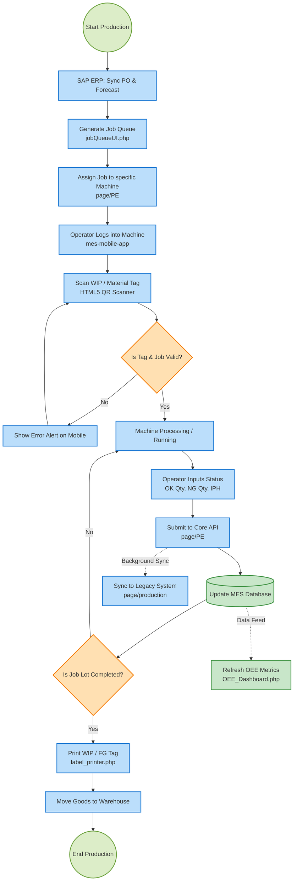

# Production Process Flowchart

This flowchart outlines the logical decision-making process and action steps an operator takes during the Machine-Based Production Execution phase.

```mermaid
flowchart TD
    Start((Start Production)) --> SAP[SAP ERP: Sync PO & Forecast]
    SAP --> JQ[Generate Job Queue<br/>jobQueueUI.php]
    JQ --> Assign[Assign Job to specific Machine<br/>page/PE]
    
    Assign --> OpLogin[Operator Logs into Machine<br/>mes-mobile-app]
    OpLogin --> Scan[Scan WIP / Material Tag<br/>HTML5 QR Scanner]
    
    Scan --> Valid{Is Tag & Job Valid?}
    Valid -- No --> Err[Show Error Alert on Mobile] --> Scan
    Valid -- Yes --> Run[Machine Processing / Running]
    
    Run --> Input[Operator Inputs Status<br/>OK Qty, NG Qty, IPH]
    Input --> PE_API[Submit to Core API<br/>page/PE]
    
    PE_API --> DB_Update[(Update MES Database)]
    PE_API -.->|Background Sync| Sync[Sync to Legacy System<br/>page/production]
    
    DB_Update --> CheckDone{Is Job Lot Completed?}
    CheckDone -- No --> Run
    CheckDone -- Yes --> Print[Print WIP / FG Tag<br/>label_printer.php]
    
    Print --> WH[Move Goods to Warehouse]
    WH --> End((End Production))
    
    %% Analytics Data Feed
    DB_Update -.->|Data Feed| OEE[Refresh OEE Metrics<br/>OEE_Dashboard.php]
    
    %% Styling
    classDef startend fill:#dcedc8,stroke:#689f38,stroke-width:2px;
    classDef action fill:#bbdefb,stroke:#1976d2,stroke-width:2px;
    classDef check fill:#ffe0b2,stroke:#f57c00,stroke-width:2px;
    classDef db fill:#c8e6c9,stroke:#388e3c,stroke-width:2px;

    class Start,End startend
    class SAP,JQ,Assign,OpLogin,Scan,Err,Run,Input,PE_API,Sync,Print,WH action
    class Valid,CheckDone check
    class DB_Update,OEE db
```
