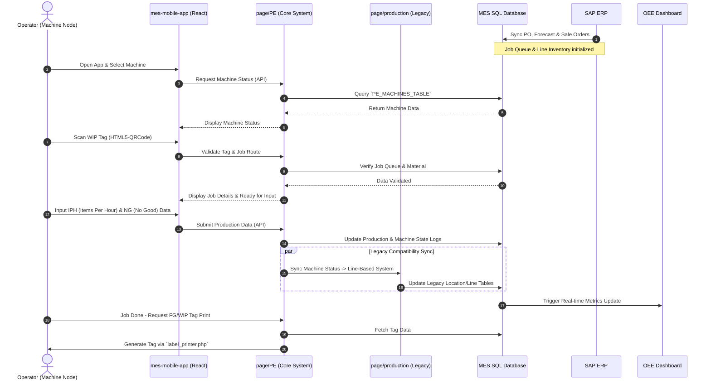

# System Sequence Diagram: Machine-Based Execution

This sequence diagram illustrates the step-by-step interactions between the operator, the mobile application, the backend PE system, the database, and legacy components during a production run.

